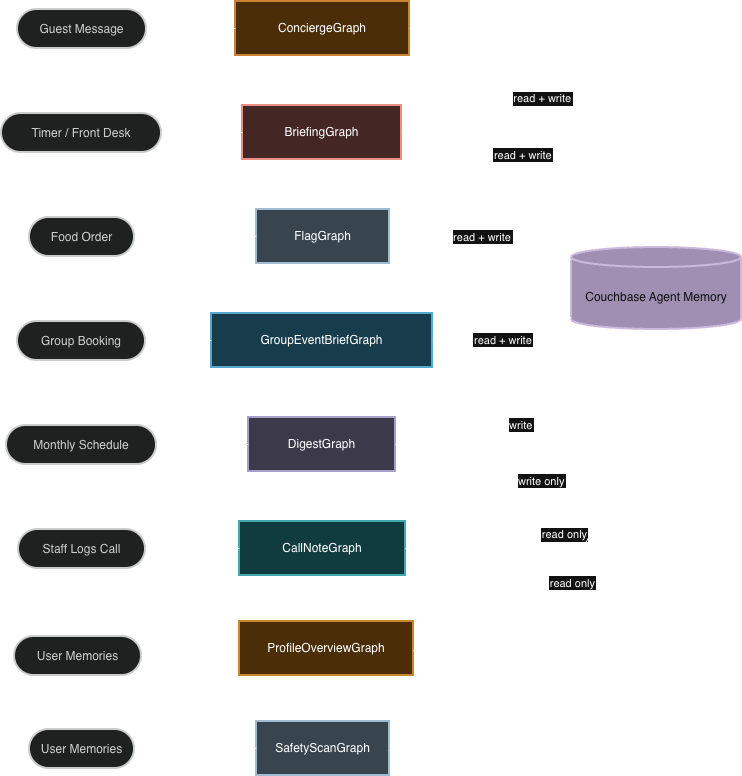

# Couchbase Agent Memory Hotel

A demo of one shared memory store powering both guest-facing and back-of-house workflows for a hotel. Eight LangGraph agents handle different jobs, all built on a shared retrieval toolkit so retrieval depth and formatting are tuned in one place.

Two UI options ship with the demo:

- **Streamlit** — single-file UIs, easiest to run locally
- **Next.js + FastAPI** — production-style UI served from EC2 (or anywhere)

---

## TL;DR

- **Guest portal**: chat concierge for guests like Alice, Bob, and Charlie. Uses cross-session memory to remember preferences, complaints, allergies, and past events.
- **Operations portal**: staff dashboard. Pre-arrival briefings, allergy and safety flags, group event pre-briefs, monthly ops digests, role-based memory, and call-note ingestion.
- **One memory store**: everything reads and writes to the same Couchbase-backed Agent Memory store. Guest memory lives under guest IDs. Ops artifacts live under role IDs (`role_front_desk`, `role_gm`, `role_events`, `role_facilities`) so institutional knowledge survives staff turnover.

---

## Setup

> For a step-by-step, from-scratch walkthrough and a symptom→fix reference, see
> [`docs/SETUP.md`](docs/SETUP.md) and [`docs/TROUBLESHOOTING.md`](docs/TROUBLESHOOTING.md).

### Prerequisites

These must already be in place before the steps below — this demo does not install
or start them:

- **A running Couchbase Agent Memory server**, reachable at `AGENTMEM_BASE_URL`
  (default `http://localhost:8080`).
- **A Couchbase backend** (Capella or self-hosted cluster) behind that server.
- **The `agentmemory` SDK installed in the same environment you run the demo from**
  (PyPI package `couchbase-agent-memory` — i.e. inside the venv you create in
  step 1, or your active Python env).
- **Python 3.12+** (3.14 is known-good) and, for the Next.js UI, **Node.js 18+ / npm**.
- **An OpenAI API key.**

This demo is only a *client* of the memory server — it makes HTTP calls to it and
never talks to Couchbase directly.

### 1. Python environment

```bash
python3 -m venv .venv
source .venv/bin/activate
pip install -r requirements.txt

# confirm the SDK prerequisite is importable in THIS env
python -c "from agentmemory import AgentMemoryClient; print('SDK ok')"
```

If that last line raises `ModuleNotFoundError`, the SDK prerequisite isn't
installed in this venv — install it there before continuing.

### 2. Configure environment

```bash
cp .env.example .env
```

The demo reads only these variables — edit `.env` accordingly:

```env
OPENAI_API_KEY=sk-...            # required — all agents call an LLM via langchain-openai
AGENTMEM_BASE_URL=http://localhost:8080   # the Agent Memory service URL
MODEL=gpt-4o-mini                # optional — defaults to gpt-4o-mini
```

> `.env.example` also contains `COUCHBASE_*` and `TAVILY_API_KEY`. The demo does
> **not** read those — `COUCHBASE_*` are configured on the Agent Memory service
> itself, and `TAVILY_API_KEY` is unused. You can leave them blank or delete them.
> (`AGENT_CATALOG_*` are optional and only enable agentc tracing.)

### 3. Seed data

```bash
python couchbase_setup.py --data data/hotel_demo.json
```

This writes Alice, Bob, and Charlie's seed conversations into the Agent Memory
store (users `alice_chen`, `bob_morrison`, `charlie_wu`).

> The service indexes memory asynchronously. Give it ~30–60s after seeding before
> search-driven views (profile, safety scan, digest) return full results.

---

## Option A — Streamlit UI

The original two-app setup. No build step required.

```bash
# Terminal 1 — guest portal (port 8501)
streamlit run agentmem_hotel.py --server.port 8501

# Terminal 2 — ops portal (port 8503)
streamlit run agentmem_hotel_ops.py --server.port 8503
```

- Guest portal: `http://localhost:8501` — sign in as Alice / Bob / Charlie (password: `123`)
- Ops portal: `http://localhost:8503` — sign in by role (password: `ops` for all roles)

> The ops portal uses **8503** here to avoid colliding with the Next.js UI, which
> uses 8502 (Option B). Pick any free port if you run several apps at once.

When you change agent code in `agents/`, restart the Streamlit server. Hot-reload does not pick up sub-package modules.

---

## Option B — Next.js + FastAPI UI

A production-style setup with a React frontend and a FastAPI backend that the frontend calls via SSE streaming endpoints.

### 1. Start the FastAPI backend

```bash
# From multi_agent_usage/
source .venv/bin/activate
uvicorn hotel_server:app --host 0.0.0.0 --port 8001 --reload
```

Or with PM2 (as used on EC2):

```bash
pm2 start start_server.sh --name hotel-server
```

### 2. Configure the Next.js environment

```bash
cd hotel_ui
cp .env.local.example .env.local
```

Edit `.env.local`:

```env
NEXT_PUBLIC_API_URL=http://localhost:8001
```

On EC2 or a remote host, set this to the public address of the FastAPI server.

The frontend calls its own `/api/*` path; `next.config.mjs` rewrites `/api/*` to
`NEXT_PUBLIC_API_URL` (default `http://localhost:8001`) at server start. Restart
the Node process after changing this value.

### 3. Install and run the Next.js UI

```bash
cd hotel_ui
npm install

# Development (hot reload)
npm run dev

# Production build + start
npm run build
npm start
```

- Guest portal: `http://localhost:8502/guest`
- Ops portal: `http://localhost:8502/ops`

With PM2:

```bash
pm2 start start_ui.sh --name hotel-ui
```

### EC2 / remote deployment

The EC2 deployment uses PM2 to manage both processes. `start_server.sh` runs FastAPI on port **8502**; `start_ui.sh` overrides package.json to run Next.js on port **8501** so both can coexist.

> `start_server.sh` and `hotel_ui/start_ui.sh` resolve paths relative to
> themselves, so they run from any checkout. Ports default to **8502** (backend)
> and **8501** (UI) and can be overridden with `PORT` / `UI_PORT`.

Set `NEXT_PUBLIC_API_URL` in `hotel_ui/.env.local` to the public URL of the EC2 instance on port 8502 before building:

```env
NEXT_PUBLIC_API_URL=http://<ec2-public-ip>:8502
```

After pulling new code:

```bash
# Rebuild and restart the UI after frontend changes
cd hotel_ui && npm run build
pm2 restart hotel-ui

# Restart the backend after Python changes
pm2 restart hotel-server --update-env
```

Access on EC2: guest portal at `http://<ec2-public-ip>:8501/guest`, ops portal at `http://<ec2-public-ip>:8501/ops`.

---

## Why this exists

Hotels lose information constantly. A guest mentions a shellfish allergy at dinner once, it gets logged in a notebook, and three years later when their husband orders room service nobody remembers. A group organiser had a bad experience with AV equipment last quarter, the events team rotates, and the same problem ships again.

This demo shows what changes when memory becomes the source of truth instead of a side effect of logging.

### Three guest personas

| Persona | Profile | Capability tested |
| --- | --- | --- |
| **Alice** (Corporate Traveler) | 5–6 dense business stays per year | Cross-session retrieval under a dense memory store. Recent complaints outrank older positives. |
| **Bob** (Occasion Traveler) | 2–3 sentimental stays per year, months apart | Stitching low-salience facts across long gaps. Third-party memory (husband's allergy, mother's mobility). |
| **Charlie** (Group Organiser) | Books for 30–50 attendees per event, doesn't stay himself | Indirect-relationship reasoning. Multi-hop retrieval ("better than last time"). Contradiction handling across past events. |

---

## Architecture



### What each agent does

Every agent is a LangGraph `StateGraph`. Each has its own prompt, output schema, and write target. They all share one memory store and one retrieval toolkit (`agents/memory_toolkit.py`): every `session.search_memory` call goes through `search_memories`, every prompt-ready memory dump goes through `format_memories`, and per-agent retrieval depth (`relevant_k`) lives in `agents/config.py`. Changing how memory is fetched or rendered is a one-file edit.

| Agent | Trigger | Reads | Writes | Output |
| --- | --- | --- | --- | --- |
| **ConciergeGraph** | Guest chat message | Guest memory across all sessions | Guest namespace | Natural-language reply |
| **ProfileOverviewGraph** | Guest portal sidebar render | Guest memory across all sessions | (read-only) | Structured profile: visits, preferences, dislikes, complaints, allergies, accessibility |
| **BriefingGraph** | Manual button or timer (T-12h) | Guest memory (full) | `role_front_desk` | Briefing card: preferences, complaints, safety flags (guest + companions), recovery actions |
| **SafetyScanGraph** | Ops dashboard load | Guest memory scoped to safety/dietary | (read-only) | Allergy/safety items shown on dashboard cards |
| **FlagGraph** | Form submission (room service, booking, dietary intake) | Guest memory scoped to safety/dietary | `role_front_desk` (only if `has_flag=true`) | Allergy/safety flag — LLM cross-checks trigger payload against retrieved memory, cites `[block:<id>]` |
| **DigestGraph** | Monthly schedule or "Run now" | All guests in parallel | `role_gm` | Monthly report: recurring complaints, requests, spend/loyalty signals, action items |
| **GroupEventBriefGraph** | New group booking confirmed | Organiser's memory across past events | `role_events` | Facilities brief: failures, accessibility needs, privacy flags, action items |
| **CallNoteGraph** | Staff call-note form/upload | Guest memory (dedupe scope) | Guest namespace | Structured fact written into the guest's session |

### Memory retrieval design

`agents/memory_toolkit.py` is the single point of contact with the SDK:

- **`search_memories(session, queries, k)`** — fans out queries in parallel threads, deduplicates on `block_id`, and supplements results with a direct `session.get_memory()` call (run concurrently) to catch blocks not yet indexed in the Couchbase FTS vector index.
- **`_record_from_memory_block`** — resolves block content in order: `summary → contexts → fact → raw message` (fallback for unprocessed blocks).
- **`format_memories(records)`** — renders records into a prompt-ready sectioned string.
- **`make_retrieval_node(queries, k)`** — LangGraph node factory used by briefing, safety scan, and group event brief agents.
- **`get_user_session`** — always uses the newest session as the entry point so recently written blocks are reachable via direct supplement.

### LangGraph topology

```
ConciergeGraph          START → query-rewrite → memory-retrieval → response-agent → END
ProfileOverviewGraph    START → memory-retrieval (10 queries) → profile-agent → END
BriefingGraph           START → memory-search (10 queries + direct) → briefing-agent → END
SafetyScanGraph         START → memory-retrieval → safety-scan-agent → END
FlagGraph               START → memory-search (base + payload-specific) → flag-agent → END
DigestGraph             START → multi-user-fan-out (N guests × 7 queries) → digest-agent → END
GroupEventBriefGraph    START → memory-search (organiser, event scope) → group-brief-agent → END
CallNoteGraph           START → classify → memory-search (dedupe) → enrich → write → END
```

### Memory write annotations

| Source | Namespace | Annotations |
| --- | --- | --- |
| ConciergeGraph | guest | `source=concierge_agent` |
| BriefingGraph | `role_front_desk` | `source=pre_arrival_briefing`, `ref_user=<guest_id>` |
| FlagGraph (when flagged) | `role_front_desk` | `source=safety_flag`, `ref_user=<guest_id>` |
| DigestGraph | `role_gm` | `source=monthly_ops_digest` |
| GroupEventBriefGraph | `role_events` | `source=group_event_brief`, `ref_user=<organiser_id>` |
| CallNoteGraph | guest | `source=call_note`, `category=<classification>` |

---

## File layout

```
multi_agent_usage/
├── README.md
├── docs/                           SETUP.md + TROUBLESHOOTING.md
├── requirements.txt                Python dependencies
├── .env.example                    template for env vars
│
├── agentmem_hotel.py               Guest concierge UI — Streamlit version
├── agentmem_hotel_ops.py           Operations portal UI — Streamlit version
│
├── hotel_server.py                 FastAPI backend for the Next.js UI
│                                   Exposes /auth, /chat, /ops/* SSE endpoints
├── start_server.sh                 Starts hotel_server.py (used by PM2)
│
├── prompts.py                      Jinja2 prompt templates for all agents
├── couchbase_setup.py              Seed data ingestion pipeline
│
├── data/
│   └── hotel_demo.json             Alice / Bob / Charlie seed conversations
│
├── catalog/
│   └── prompts/                    YAML prompt definitions for agentc catalog
│
├── agents/                         One file per agent
│   ├── __init__.py
│   ├── memory_toolkit.py           Shared retrieval: search_memories,
│   │                               format_memories, make_retrieval_node,
│   │                               QueryRewriter. The ONLY place that calls
│   │                               session.search_memory / get_memory.
│   ├── config.py                   MEMORY_K per agent — tune retrieval depth here
│   ├── _ops_utils.py               Internal helpers: role writes, JSON parse,
│   │                               session resolution (get_user_session)
│   ├── concierge_agent.py
│   ├── profile_overview_agent.py
│   ├── briefing_agent.py
│   ├── safety_scan_agent.py
│   ├── flag_agent.py
│   ├── digest_agent.py
│   ├── group_event_brief_agent.py
│   └── call_note_agent.py
│
└── hotel_ui/                       Next.js frontend
    ├── app/
    │   ├── guest/                  Guest chat portal pages
    │   └── ops/                    Operations portal pages
    ├── components/
    │   ├── guest/                  Chat UI components
    │   ├── ops/                    Ops view components (briefings, flags, digest, …)
    │   └── shared/                 StatusPipeline, OpsViewWrapper, etc.
    ├── store/                      Zustand state (opsStore, guestStore)
    ├── lib/                        API helpers, types, SSE streaming
    ├── .env.local.example          Template for Next.js env vars
    ├── package.json
    └── start_ui.sh                 Starts next start (used by PM2)
```

---

## How the demo flows

### Guest flow (chat)

1. Sign in as Alice, Bob, or Charlie.
2. Send a message in the chat.
3. `ConciergeGraph` runs: refines the search query, retrieves cross-session memory, generates a personalised reply, and writes the new turn back to the guest's session.
4. The pipeline view shows memory search time, LLM time, and total latency.
5. The profile sidebar shows a live extract of the guest's preferences, allergies, complaints, and past stays.

### Operations flow

| View | What happens |
| --- | --- |
| **Dashboard** | Safety scan runs on load for all guests in parallel. Shows last digest timestamp and flagged orders. |
| **Pre-Arrival Briefings** | Pick a guest and arrival time → `BriefingGraph` fans out 10 memory queries in parallel, supplements with direct block fetch, synthesises a briefing card (preferences, complaints, safety flags for guest + companions, recovery actions), writes to `role_front_desk`. |
| **Food Allergen Check** | Submit a food order for a guest → `FlagGraph` cross-checks against retrieved memory. No hardcoded allergen lists — the LLM decides. Cites `[block:<uuid>]` as evidence. |
| **Group Event Pre-Brief** | Pick an organiser and event details → `GroupEventBriefGraph` reads past-event memory, writes facilities brief to `role_events`. |
| **Monthly Ops Digest** | Fan-out across all guests in parallel → `DigestGraph` aggregates recurring patterns, writes summary to `role_gm`. |
| **Log Guest Call** | Submit a call note → `CallNoteGraph` classifies, deduplicates, and writes a structured fact into the guest's namespace. |
| **Role Memory** | Read-only inspector of everything written under each role namespace. |

Every agent run shows:

```text
Memory retrieval   <ms>
LLM synthesis      <ms>
Total              <ms>
```

---
